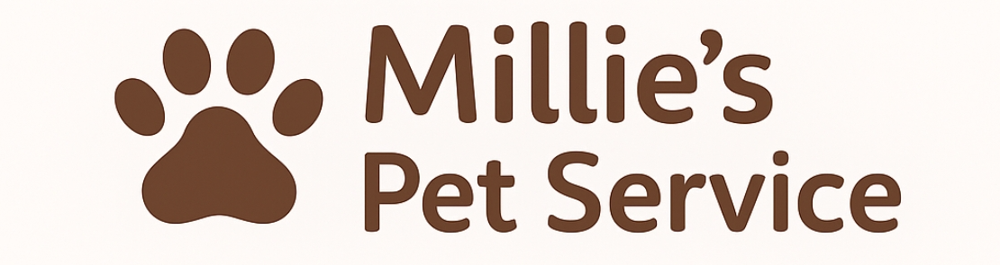

# 🐾 Millie's Pet Service LLC

🌐 **Live Demo:** [mpetserv.com](https://mpetserv.com)

A modern, mobile-friendly website for **Millie’s Pet Service LLC** — a local dog walking and pet care business in Colorado Springs.  
Visitors can explore services, view policies, check the rotating gallery, and contact Millie directly via a simple message form that sends inquiries straight to her email.



---

## 🌟 Features

- 📱 **Fully Responsive Design** — optimized for phones, tablets, and desktops
- 🐶 **Services & Pricing Section** — clear breakdown of walks, drop-ins, and sitting
- 🧾 **Policies Page** — detailed info on vaccinations, cancellations, payments & more
- 🖼️ **Rotating Photo Gallery** — smooth fade‑in/out transitions showcasing pets
- ⭐ **Client Reviews** — 4–5 star reviews with optional photo uploads
- 💌 **Contact Form (Formspree)** — messages go directly to Millie’s inbox
- ❤️ **Animated Branding** — pulsing heart accent and round logo integration
- 🎨 **TailwindCSS Styling** — clean, modern, and mobile-first design
- 🛡️ **Certification Badges** — AHTA CPR/First Aid + PCI Insurance
- ⚡ **Static, Fast, and Secure** — lightweight Next.js site with zero backend required

---

## 🧰 Tech Stack

- **Framework:** Next.js 14 (App Router)
- **Styling:** TailwindCSS
- **Forms:** Formspree
- **Deployment:** Vercel
- **Email:** Formspree → business inbox

---

## 🚀 Local Setup

1. **Clone the repository**

   ```bash
   git clone https://github.com/bbeare22/millies-pet-service.git
   cd millies-pet-service
   ```

2. **Install dependencies**

   ```bash
   npm install
   ```

3. **Run the development server**
   ```bash
   npm run dev
   ```
   Visit → http://localhost:3000

---

## 🧑‍💻 Project Structure

```
.
├── app/
│   ├── contact/
│   ├── policies/
│   ├── services/
│   └── page.tsx
├── components/
│   ├── Gallery.tsx
│   ├── Reviews.tsx
│   ├── ServiceCard.tsx
│   ├── Nav.tsx
│   ├── Footer.tsx
│   └── ContactForm.tsx
├── public/
│   ├── millies-logo.png
│   ├── paw.png
│   └── images/gallery/*
└── styles/
```

---

## 🧾 Recent Updates (Nov–Dec 2025)

- 🐾 **Added full rotating gallery** with 18+ images
- ✨ **Smooth fade-in/out animation system**
- ⭐ **Reviews system with photo uploads**
- 🐾 **Dog paw icons added throughout the UI**
- 🛡️ **Added AHTA + PCI certification badges**
- 📷 **Improved image handling for HEIC/AVIF/JPG**
- 🎨 Fine‑tuned responsive layout and spacing
- ⚙️ Updated Formspree endpoint

---

## 💡 Future Enhancements

- [ ] More advanced gallery layout
- [ ] Searchable FAQ section
- [ ] SMS autoresponder for contact form
- [ ] Lightweight admin page to approve new reviews
- [ ] SEO polish & OpenGraph gallery images

---

## 📄 License

MIT © 2025 — Developed by **Brett Beare**  
Designed for **Millie’s Pet Service LLC** 🐾

---

> “Because every tail deserves a happy wag.” 💕
